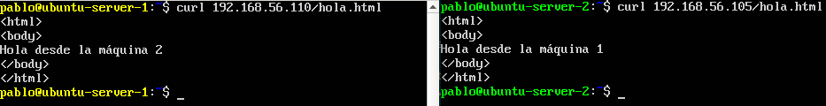
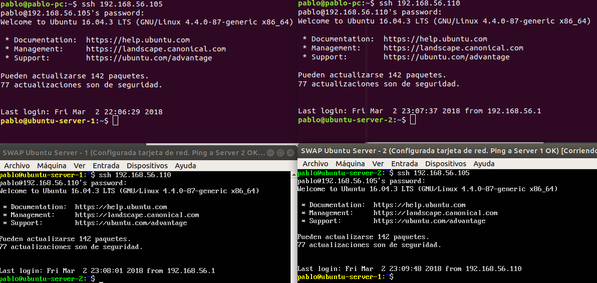

#Páctica 1 - Configuración de máquinas en VirtualBox#

1. ###Instalación de Ubuntu Server
Para la instalación de Ubuntu Server he creado dos máquinas con 1 GB de memoria RAM y 10 GB de almacenamiento. He instalado la versión 16.04 LTS por defecto y he utilizado la herramienta ofrecida por el propio instalador para instalar LAMP y OpenSSH.

2. ###Configuración de red anfitrión
  He configurado la red anfitrión y habilitado el servidor DHCP con los siguientes parámetros:
  - **Dirección IPv4 del servidor**: 182.168.56.1
  - **Dirección del servidor**: 192.168.56.100
  - **Máscara del servidor**: 255.255.255.0
  - **Límite inferior de direcciones**: 192.168.101
  - **Límite superior de direcciones**: 192.168.254

  He añadido una tarjeta de red a cada máquina en *Adaptador 2* y las he "conectado" a la red anfitrión infitrión.
He iniciado las máquinas y ejecutado `ifconfig` para comprobar si estaban conectadas a la red. No veía la interfaz de red añadida, por lo que ejecuté `sudo dhclient` y al volver a ejecutar `ifconfig` sí veía la interfaz *enp0s8*.
He añadido al final del archivo `/etc/network/interfaces`:
```
auto enp0s8
iface enp0s8 inet static
address 192.168.56.105 (en la máquina 1) y address 192.168.56.110 (en la máquina 2)
netmask 255.255.255.0
```

  Si quisiera que el servidor DHCP estableciera la IP de mis máquinas de forma dinámica, cambiaría "static" por "dhcp" y eliminaría las líneas en las que establezco la IP de la máquina y la máscara de red. No he indicado la puerta de enlace predeterminada porque Ubuntu Server a veces no permite conexiones a red cuando se indica.

3. ###Petición HTTP entre máquinas
  Lo primero es modificar los permisos de los directorios `/var/www/html` para poder añadir archivos sin usar órdenes de superusuario. Para ello, he ejecutado `chmod 777 /var/www/html`. A continuación he creado en dichos directorios los archivos `hola.html` con el contenido:
  ```
  <html>
  <body>
  Hola desde la maquina 1/2
  </body>
  </html>
  ```
  He ejecutado `curl [dirección IP de la otra máquina]/hola.html` y estos han sido los resultado que he obtenido: 

  

  Igualmente, desde un navegador de mi máquina física, he accedido a los ficheros hola.html de ambas máquinas y este ha sido el resultado obtenido:

  <center></center>
<enter>

4. ###Conexión por SSH a las máquinas virtuales
  Para realizar las conexiones SSH no he necesitado hacer ninguna configuración adicional. Tras ejecutar el comando `ssh [dirección IP de la otra máquina]` he tenido acceso a la máquina a la que quería acceder: 
  
  

