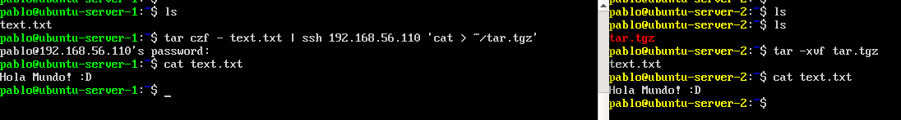
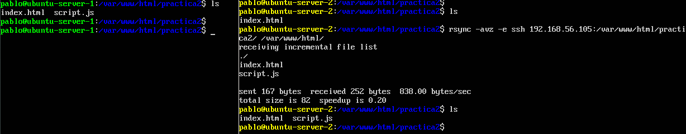
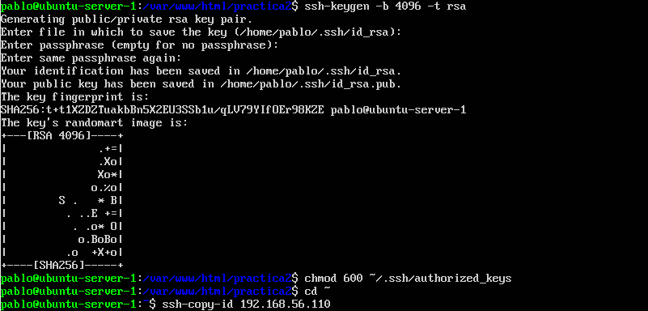
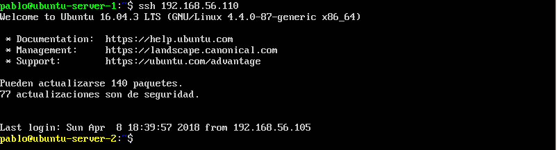

# Páctica 2 - Clonar la Información de un Sitio Web

1. ### Crear un tar con ficheros locales en un equipo remoto
  En el servidor 1 he creado un archivo "text.txt" con el contenido "Hola Mundo! :D" y he ejecutado `tar czf - text.txt | ssh 192.168.56.110 'cat > ~/tar.tgz` para copiar el archivo al servidor 2.
  
  

2. ### Clonado de una carpeta entre las dos máquinas
  He instalado en ambas máquinas rsync ejecutando `sudo apt-get install rsync`. Desde la máquina 2 he ejecutado `rsync -avz -e ssh 192.168.56.105:/var/www/html/practica2 /var/www/html/` para copiar la carpeta en la que está mi "proyecto web":
  
  

3. ### Configuración de SSH para acceder sin contraseña
  
  

4. ### Crear un cron que mantenga actualizada la carpeta del "proyecto web" (/var/www/html/practica2)
  En el fichero /etc/crontab añadimos la línea: `* *	* * * pablo rsync -avz --delete -e ssh 192.168.56.105:/var/www/html/practica2/ /var/www/html/practica2` para que elimine los archivos que se hayan eliminado en la máquina 1 y copie los demás.
