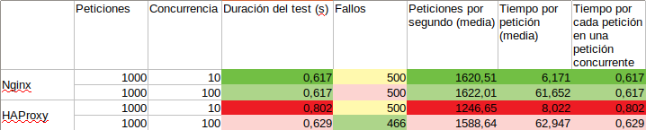

# Páctica 3 - Balanceo de Carga

1. ### Configuración previa a la práctica
Para comenzar, he creado una nueva máquina virtual identica a las 2 ya existentes. Mismas especificaciones HW y mismo sistema operativo. He conectado la máquina a la red anfitrión creada en la práctica 1 y he configurado una IP estática en la misma añadiendo en el archivo `/etc/network/interfaces` las siguientes directivas: 
```
auto enp0s8
iface enp0s8 inet static
address 192.168.56.115
netmask 255.255.255.0
```
En esta máquina he instalado Nginx y HAProxy siguiendo el tutorial de la práctica y he comprobado que los servicios no estuvieran corriendo. 
En los dos servidores web que tenía, he añadido en el directorio `/var/www/html` he creado dos archivos index.html que identifiquen a cada una de las máquinas.

2. ### Balanceo de carga con Nginx
He configurado Nginx según el tutorial de la práctica. Al tratar de levantar el servicio obtuve un error. Aparantemente, Nginx detectaba dos configuraciones diferentes y no sabía cuál debía usar. Para solucionarlo, eliminé la configuración por defecto: `sudo rm /etc/nginx/sites-enabled/default`.
Después de esto, todas las configuraciones funcionaron correctamente. 

3. ### Balanceo de carga con HAPoxy
De la misma manera que Nginx, he configuradop HAProxy siguiendo el tutorial. He parado el servicio de Nginx, levantado el de HAProxy y ha funcionado correctamente. No obstante, he obtenido un warning indicando que algunas directivas están actualmente en estado "deprecated".

4. ### Simulado de carga con Apache Benchmark
Aprovechando que en mi máquina anfitriona tengo instalado Apache, he ejecutado el comando `ab` desde la misma, llamando a mi servidor balanceador alternando el servicio que balanceaba. Lo he ejecutado dos veces con cada servicio, ambas haciendo 1000 peticiones, la primera con 10 peticiones concurrentes y la segunda con 100 peticiones concurrentes. 
Estos son algunos de los resultado obtenidos:

A simple vista es fácil ver que los resultados usando Nginx han sido superiores. El único valor en el que ha "ganado" HAProxy puede haber sido por cualquier causa externa a las máquinas y el test.
Además, si observamos los tiempos de conexión, vemos que han sido en todo caso menores cuando usábamos Nginx. 