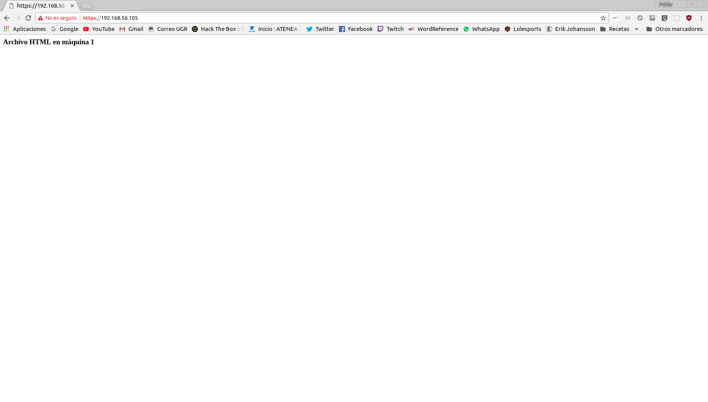
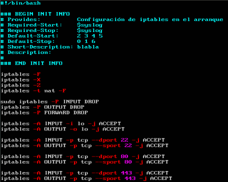
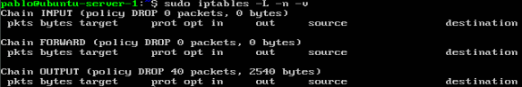
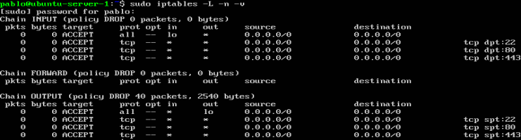

# Páctica 4 - Asegurar la Granja Web

1. ### Configuración HTTPS
He instalado el mod para SSL en el servidor apache de la M1: `sudo a2enmod ssl` y he reiniciado el servicio de Apache. He creado la carpeta `ssl` en el directorio de Apache (`/etc/apache2`). He creado el certificado y la clave privada con openssl: `openssl req -x509 -nodes -days 365 -newkey rsa:2048 -keyout /etc/apache2/ssl/apache.key -out /etc/apache2/ssl/apache.crt` 
En el fichero `/etc/apache2/sites-available/default-ssl` he indicado las rutas al certificado y la clave añadiendo las directivas `SSLCertificateFile` y `SSLCertificateKeyFile`. He activado mod SSL y he reiniciado el servicio de Apache de nuevo.
Desde el navegador de la máquina anfitriona, he accedido a la máquina mediante HTTPS: 

En la M1 he activado el acceso como root mediante SSH: en el archivo `/etc/ssh/sshd_config` he indicado "PermitRootLogin yes" y he ejecutado `sudo passwd` para indicar la contraseña del usuario root.
En la máquina 2 y en el balanceador, he creado la carpeta `ssl` en los directorios `/etc/apache2` y `/etc/nginx` respectivamente. Para copiar el certificado y la clave a ambas máquinas, he ejecutado `sudo scp root@192.168.56.105:/etc/apache2/ssl/* /etc/[apache-nginx]/ssl`
En el balanceador, he activado el protocolo HTTPS modificando el fichero `/etc/nginx/conf.d/default.conf`. El apartado server he añadido:
```
listen 443 ssl;
ssl_certificate /etc/nginx/ssl/apache.crt;
ssl_certificate_key /etc/nginx/ssl/apache.key;
ssl_protocols TLSv1 TLSv1.1 TLSv1.2;
ssl_ciphers HIGH:!aNULL:!MD5;
```
Y ya puedo acceder por HTTP y HTTPS al balanceador.

2. ### Configuración de iptables
He creado el siguiente script:

Lo he guardado en el directorio /etc/init.d/iptables_web.sh
Le he dado permisos de ejecución y he ejecutado: `sudo update-rc.d iptables_web.sh defaults` para que se ejecute en el arranque. Es necesario el comentario al inicio del script para indicar información al SO en el arranque.
He borrado todas las reglas y he reniciado la máquina y se crean las reglas indicadas.



