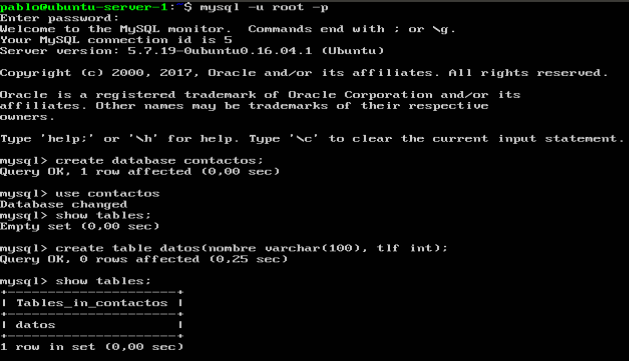
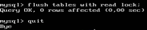
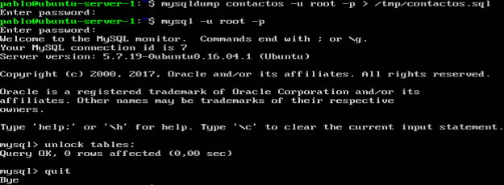
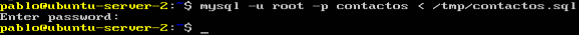
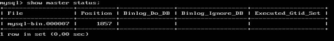
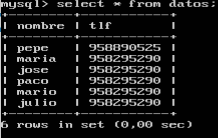
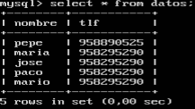

# Páctica 5 -  Replicación de bases de datos MySQL

1. ###  Crear una BD e insertar datos
En la máquina 1 he creado la base de datos "contactos" y en ella la tabla "datos":

2. ### Copia de seguridad utilizando mysqldump
He insertado algunos datos, bloqueado las tablas y ejecutado mysqldump. Una vez hecho he desbloqueado las tablas:

En la máquina 2, he copiado el archivo creado en la máquina 1 utilizando scp:

He creado la BD "contactos" e insertado el fichero en Mysql:

3. ### Replicación de BD mediante una configuración maestro-esclavo
En ambas máquinas he modificado el archivo "/etc/mysql/mysql.conf.d/mysql.conf.
He comentado las líneas `bind-address`, `log_error`y `log_bin`. El parámetro `server-id` lo he establecido a 1 en la máquina 1 y a 2 en la máquina 2.
En la máquina 1 he creado un usuario al que se conectará la máquina 2 y le he otorgado permisos de replicación.
He comprobado la posición del maestro en el fichero binario con `show master status`:

En la máquina 2 he indicamos cuál es su nuevo maestro: 
`CHANGE MASTER TO MASTER_HOST='192.168.56.105', MASTER_USER='esclavo', MASTER_PASSWORD='esclavo', MASTER_LOG_FILE='mysql-bin.000010', MASTER_LOG_POS=154,MASTER_PORT=3306;`
Y he iniciado el esclavo: `start slave`
Hago un select en la máquina 2 de la tabla datos:

Elimino la tupla de "julio" desde la máquina 1:
`delete from datos where nombre="julio";`
Y hago otro select desde la máquina 2:

